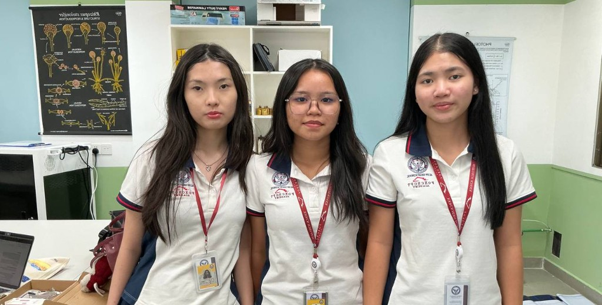
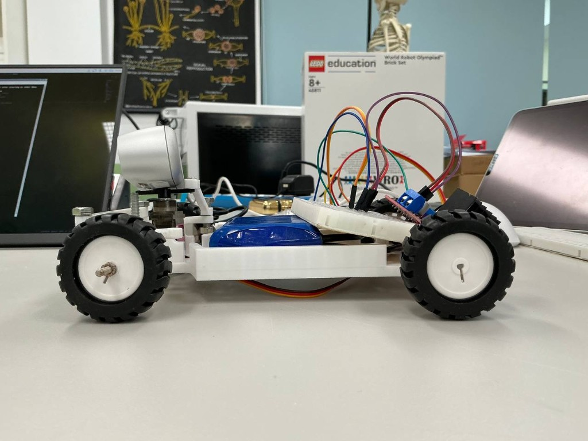
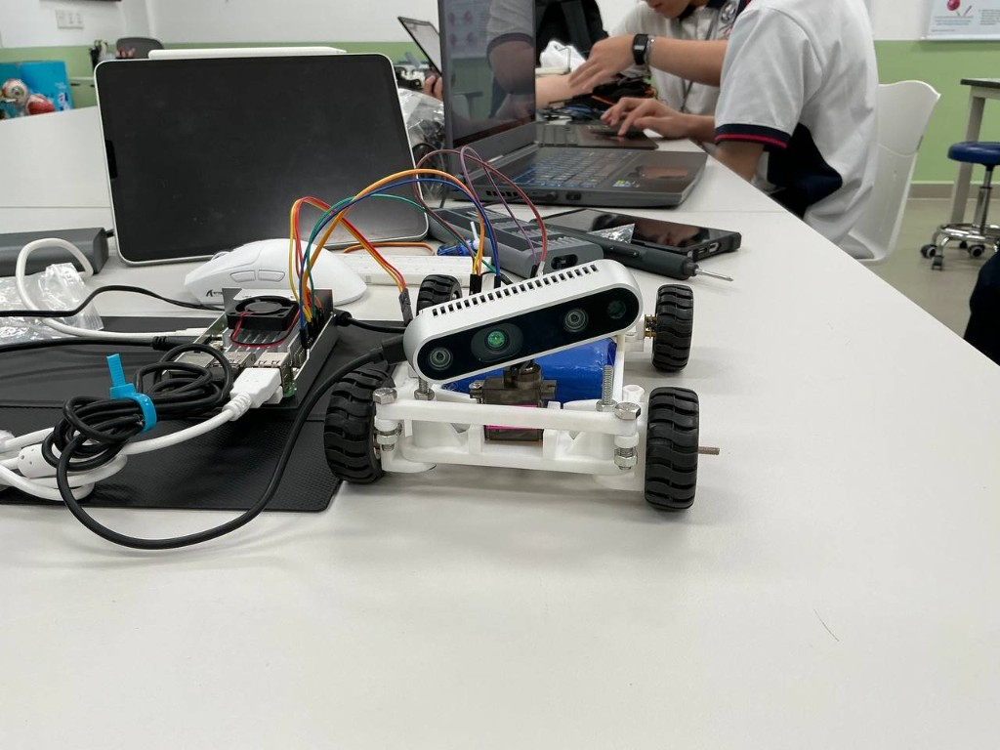
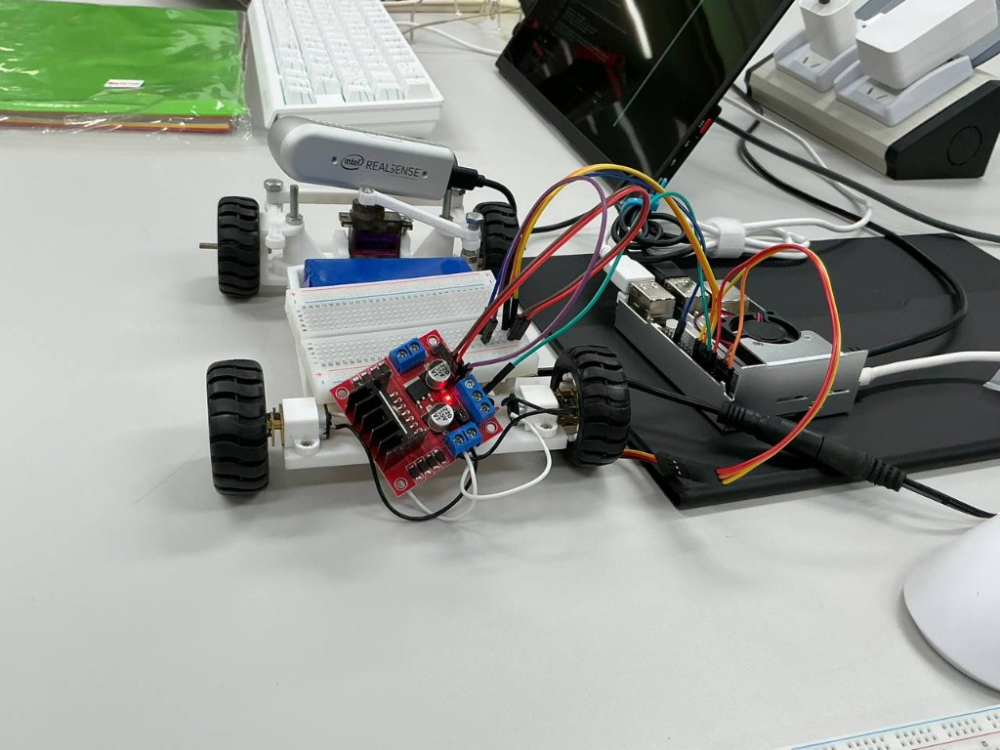
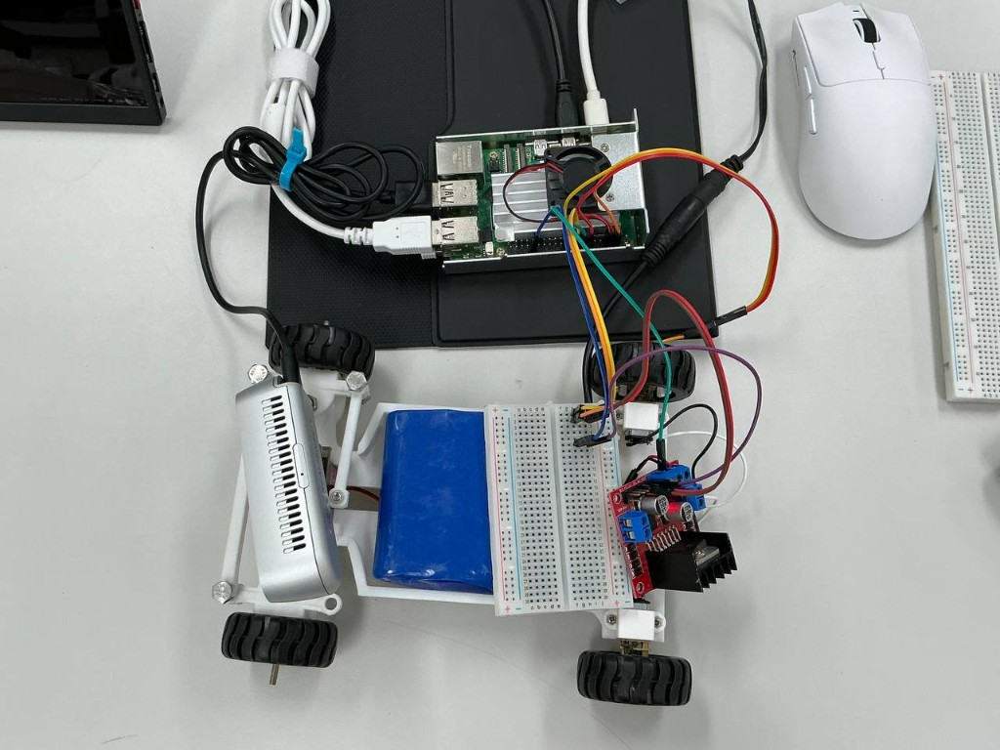
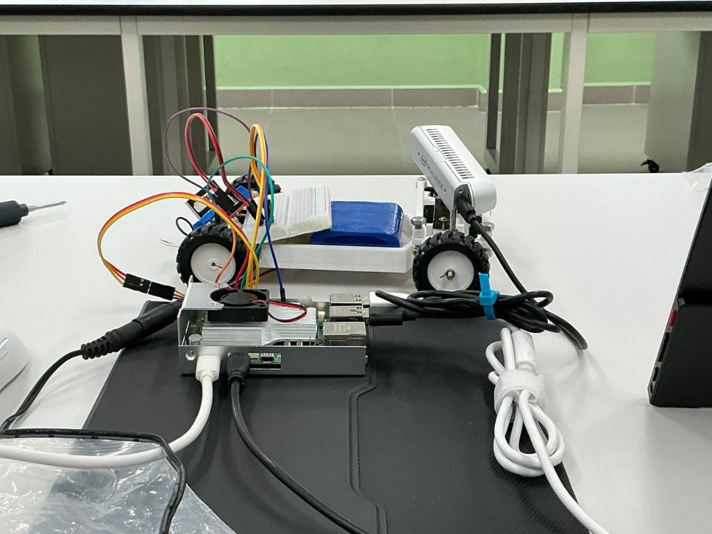

# Triple T — WRO Future Engineers 2026

This repository documents Team Triple T's entry for the WRO Future Engineers 2026 competition. It will contain the team's engineering journal, source code, mechanical and electrical designs, testing evidence, and instructions needed to reproduce the autonomous vehicle.

## Team

### Members

- Tuy Caroline
- Thavrak Bunn Raksa
- Lim Anita

### Coach

- Lean Ratana

### Team photo

## Competition

- **Category:** WRO Future Engineers
- **Country:** Cambodia
- **Organizer:** STEM Cambodia
- **Competition date:** September 5, 2026
- **Documentation deadline:** August 28, 2026

## Current vehicle design

### Computing and software

- **Main controller:** Raspberry Pi 5
- **Programming language:** Python
- **Vision library:** OpenCV

### Mobility and mechanical design

- **Chassis and steering geometry:** Ackermann steering
- **Motor driver:** L298N
- **Steering servo:** MG90S
- **Drive motor:** Model to be documented
- **Vehicle dimensions and weight:** To be measured
- **Wheel size and gear ratio:** To be measured

### Sensors and perception

- **Camera:** Intel RealSense D435i
- **Other sensors:** None
- **Pillar detection:** OpenCV color detection is used to distinguish red and green pillars.

### Navigation strategy

The camera image is divided into regions of interest. When a target track color appears in a particular region, the program selects the corresponding steering direction. The exact regions, color thresholds, and steering rules are still being documented.

The parking strategy has not yet been implemented.

### Power system and current issue

- **Available battery voltage:** 12 V
- **Current issue:** A portable regulated power supply for the Raspberry Pi 5 is not yet available.

The Raspberry Pi 5 cannot be powered directly from the 12 V battery. A suitable regulated supply and a complete power-distribution design are still required.

## Vehicle photographs

### Side view 1

### Front view

### Rear and electronics view

### Top view

### Side view 2

A bottom-view photograph is still required to complete the WRO vehicle photo set.

## Documentation status

The engineering documentation is currently in progress. Technical details, source code, diagrams, photographs, CAD files, test results, and autonomous-driving videos will be added as they become available.

## Planned documentation

- Mobility and mechanical design
- Power and sensor architecture
- Software architecture and obstacle strategy
- Systems thinking and engineering decisions
- Assembly and reproduction instructions
- Engineering journal
- Testing workflow and results
- Vehicle and team photographs
- Open Challenge and Obstacle Challenge videos

