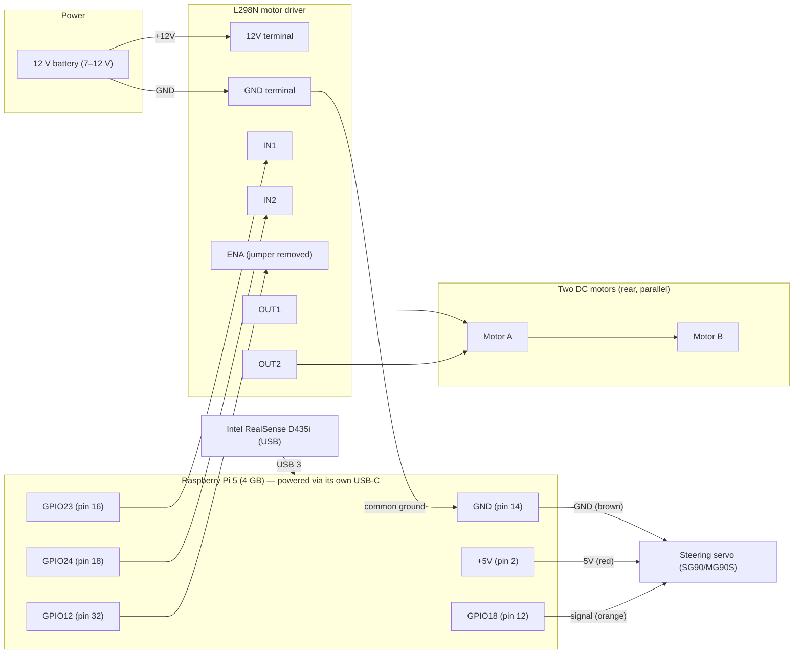
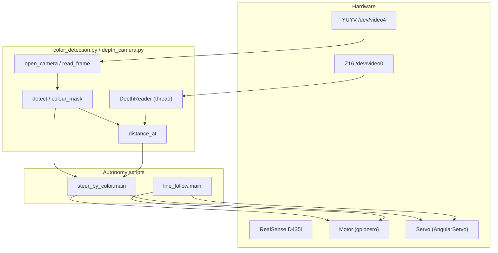
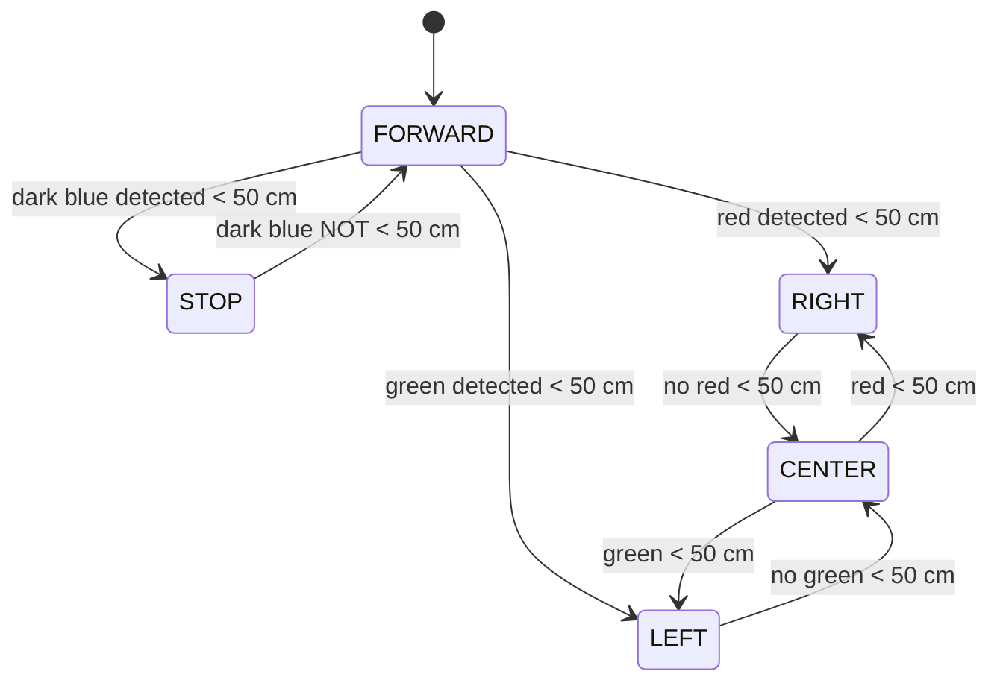
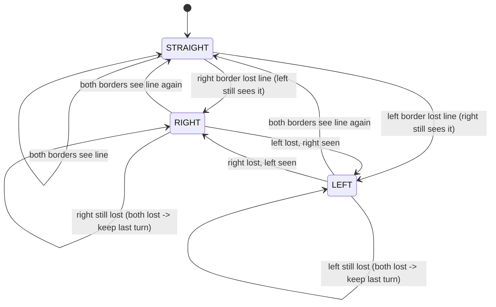

# WRO 2026 Future Engineers — Robot Project Audit (READ-ONLY)

> **Team:** Triple T — Tuy Caroline, Thavrak Bunn Raksa, Lim Anita
> **Coach:** Lean Ratana · **Country:** Cambodia · **Organizer:** STEM Cambodia
> **Competition date:** 5 September 2026
>
> This report is the result of a **read-only inspection** of the project on the
> robot's Raspberry Pi (no code, wiring, configuration, or Git state was changed;
> motors/servos were never operated). Every fact below is either directly
> observed or clearly marked as an **assumption**. Anything not verifiable is
> marked **Unknown**.

---

## 1. PROJECT INVENTORY

### 1.1 Exact project and source-code paths

| Item | Path |
|---|---|
| Project root | `/home/aaron/robot_car` |
| Python virtualenv | `/home/aaron/robot_car/robot_env` |
| Main autonomy script (colour steering) | `/home/aaron/robot_car/steer_by_color.py` |
| Line-following script | `/home/aaron/robot_car/line_follow.py` |
| Colour + depth detection library | `/home/aaron/robot_car/color_detection.py` |
| Depth camera driver (V4L2 Z16) | `/home/aaron/robot_car/depth_camera.py` |
| Human (person) detection | `/home/aaron/robot_car/human_detection.py` |
| Hardware test scripts | `/home/aaron/robot_car/test_car.py`, `/home/aaron/robot_car/test_car_gui.py` |
| Calibration helpers | `/home/aaron/robot_car/color_probe.py`, `/home/aaron/robot_car/color_sample.py` |
| Keyboard manual control | `/home/aaron/robot_car/drive_terminal.py` |
| Colour→drive demo | `/home/aaron/robot_car/drive_by_color.py` |
| Project notes | `/home/aaron/robot_car/AGENTS.md` |
| WRO 2026 rules PDF | `/home/aaron/robot_car/rules2.pdf` |
| WRO 2022 playfield PDF (legacy) | `/home/aaron/robot_car/field2.pdf` |

### 1.2 File/folder tree (relevant files only)

```
/home/aaron/robot_car/
├── AGENTS.md                 # project notes: hardware, wiring, pin map, run commands
├── autonomous_drive.py       # CORRUPT/EMPTY — 4204 bytes of NUL (see §6.8)
├── color_detection.py        # colour+depth detection, trackbar calibration, reset key
├── color_probe.py            # one-shot HSV probe of the frame centre
├── color_sample.py           # ~12 s continuous HSV sampler for tuning
├── depth_camera.py           # ctypes V4L2 Z16 depth reader (RealSense D435i)
├── drive_by_color.py         # demo: green→forward, red→backward
├── drive_terminal.py         # keyboard car control (w/s/space/a/d/c/q)
├── field2.pdf                # WRO-2022 playfield drawing (1 page, print-size)
├── human_detection.py        # colour+depth + OpenCV HOG person detector
├── .lgd-nfy0                 # named pipe (FIFO), 0 bytes, purpose Unknown
├── line_follow.py            # border-strip line following (dark blue/black)
├── __pycache__/              # compiled bytecode (evidence of executed/imported modules)
├── robot_env/                # Python 3.13.5 virtualenv (--system-site-packages)
├── rules2.pdf                # WRO-2026 Future Engineers General Rules (55 pages)
├── steer_by_color.py         # reactive colour steering + stop (main autonomy)
├── test_car.py               # servo sweep + motor fwd/back test
└── test_car_gui.py           # tkinter GUI with steering/drive buttons
```

### 1.3 Purpose of every important file

- **`steer_by_color.py`** — The most recent autonomous driving program. Drives forward
  continuously; stops only when "dark blue" is detected closer than 50 cm; steers
  right on red and left on green (each gated to <50 cm).
- **`line_follow.py`** — Autonomous line following using two vertical border strips
  (left/right) of the camera image. Keeps the dark-blue/black line under both
  strips; steers toward whichever side lost the line.
- **`color_detection.py`** — The perception library. Opens the RGB stream (pyrealsense2
  or V4L2 fallback), defines the HSV colour table, `detect()`, `distance_at()`,
  `draw_detections()`, and an interactive trackbar calibration window (with an
  `r` reset-to-defaults key). Imported by most other scripts.
- **`depth_camera.py`** — Low-level V4L2 (`Z16`) depth reader using `ctypes`/mmap
  because OpenCV cannot open the RealSense depth node directly. Also exposes
  `enable_auto_colour()` (white balance / auto exposure / saturation controls).
- **`human_detection.py`** — A copy of `color_detection.py` extended with an OpenCV
  HOG + SVM person detector (`HumanDetector`). Detection only (no driving logic).
- **`drive_terminal.py`** — Manual keyboard driving (used to verify wiring).
- **`drive_by_color.py`** — Simple demo mapping green→forward, red→backward.
- **`test_car.py` / `test_car_gui.py`** — Hardware bring-up tests (servo sweep,
  motor forward/backward).
- **`color_probe.py` / `color_sample.py`** — Calibration utilities that print HSV
  values and mask pixel counts to tune thresholds.
- **`autonomous_drive.py`** — **Corrupt.** The file is 4204 bytes of NUL bytes with
  no readable source (see §6.8). Its compiled `.pyc` is 0 bytes. Treated as an
  empty/placeholder file, not functional code.
- **`AGENTS.md`** — The team's hardware/wiring notes and run instructions
  (source of the wiring truth table in §3).

### 1.4 Git repository

- **There is no Git repository.** `git status`, `git branch`, `git log`, and
  `git remote` all return "not a git repository", and no `.git` directory exists
  anywhere under `/home/aaron` (excluding tooling). There are therefore **no
  branches, commits, messages, or history** to report. (Direct evidence: command
  output.)

### 1.5 Main program entry point

- For the current autonomous colour task: **`steer_by_color.py`** (`main()`).
- For line following: **`line_follow.py`** (`main()`).
- The shared detection library has no side effects on import (its `main()` is
  guarded by `if __name__ == "__main__"`).

---

## 2. SOFTWARE ENVIRONMENT

### 2.1 OS, architecture, platform

| Item | Observed value |
|---|---|
| Distribution | Debian GNU/Linux 13 (trixie), `VERSION_ID=13`, `DEBIAN_VERSION_FULL=13.6` |
| Kernel | `6.18.39+rpt-rpi-2712 #1 SMP PREEMPT` (`rpt` = Raspberry Pi kernel) |
| Architecture | `aarch64` (64-bit) |
| Board | Raspberry Pi 5 Model B Rev 1.1 (from `/proc/device-tree/model`) |
| RAM | 4 GB total (from `free -h`) |

> Note: `PRETTY_NAME` reports generic "Debian GNU/Linux 13", but the `rpt` kernel
> tag and Raspberry Pi firmware files (`/boot/firmware/config.txt`) confirm this is
> a Raspberry Pi OS image built on Debian 13 (trixie).

### 2.2 Python and key libraries

| Package | Version (observed via `pip list` in `robot_env`) |
|---|---|
| Python | 3.13.5 (`robot_env/bin/python` and system `python3`) |
| `opencv` (OpenCV) | 4.10.0 |
| `numpy` | 2.2.4 |
| `gpiozero` | 2.0.1 |
| `lgpio` | 0.2.2.0 (gpiozero backend on Pi 5) |
| `rpi-lgpio` | 0.6 |
| `picamera2` | 0.3.37 (installed, but **not used** by these scripts) |
| `pyrealsense2` | **Not installed** (code logs "No module named 'pyrealsense2'" and falls back to V4L2) |
| `pyserial` | 3.5 · `smbus2` 0.4.3 · `spidev` 3.6 · `gpiod` 2.2.0 (present, not used by current scripts) |

### 2.3 Full dependency list

The virtualenv was created with `--system-site-packages`, so `pip list` reflects
the entire system package set (≈460 packages: desktop, `thonny`, `pygame`,
`PyQt5`, `Flask`, etc.). The packages actually **imported by this project** are:

- `gpiozero`, `lgpio`/`rpi-lgpio` (motor + servo control)
- `opencv` (cv2) and `numpy` (perception)
- Python standard library: `ctypes`, `mmap`, `os`, `sys`, `argparse`, `threading`, `termios`, `tty`

There is **no `requirements.txt` / `pip freeze` file** in the project, so the exact
reproducible install list is **Unknown** (see §10).

### 2.4 Install and run commands

- Virtualenv already exists: `/home/aaron/robot_car/robot_env` (Python 3.13.5).
- Run (per `AGENTS.md`):
  ```
  robot_env/bin/python <script>.py
  ```
  Examples:
  ```
  robot_env/bin/python steer_by_color.py
  robot_env/bin/python line_follow.py
  robot_env/bin/python color_detection.py
  ```
- Calibration:
  ```
  robot_env/bin/python color_probe.py     # one-shot HSV + pixel match
  robot_env/bin/python color_sample.py    # 12 s continuous HSV sampling
  ```
- Hardware bring-up:
  ```
  robot_env/bin/python test_car.py
  robot_env/bin/python test_car_gui.py
  ```

### 2.5 Permissions, services, startup

- The user `aaron` belongs to groups: `sudo adm dialout cdrom audio video plugdev
  gpio i2c spi render input netdev lpadmin`. This grants access to `/dev/video*`
  (video), `/dev/gpiochip*` (gpio), and `/dev/i2c-*` (i2c) **without sudo**.
- **No systemd service, cron job, `rc.local`, or autostart** related to the robot
  exists (checked; none found). The robot is started manually from a terminal.
- **No `.env` files or environment variables** are used by the project.
- Camera device nodes are created automatically by the RealSense UVC driver.

### 2.6 Configuration files

- `/boot/firmware/config.txt` — defaults only: `arm_64bit=1`,
  `camera_auto_detect=1`, `dtoverlay=vc4-kms-v3d`, `arm_boost=1`, and a `[pi5]`
  `dtoverlay=nospi10`. No robot-specific settings.
- `robot_env/pyvenv.cfg` — `home = /usr/bin`, `version = 3.13.5`,
  `include-system-site-packages = true`.
- No secrets, credentials, tokens, or Wi-Fi keys were present in any inspected file.

---

## 3. HARDWARE AND WIRING

> Source of truth for wiring is `AGENTS.md`. Only the Raspberry Pi and the
> RealSense camera are directly observable on this machine; the motor driver,
> motors, servo, battery, and chassis are documented in `AGENTS.md` but were **not
> physically verified** during this read-only audit.

### 3.1 Verified components

| Component | Detail | Evidence |
|---|---|---|
| Raspberry Pi | Raspberry Pi 5 Model B Rev 1.1, 4 GB | `/proc/device-tree/model`, `free -h` |
| Camera | Intel RealSense D435i | `lsusb`: `8086:0b3a Intel Corp. Intel(R) RealSense(TM) Depth Camera 435i` |
| Wireless input | "Xenta 2.4G Wireless Device" (keyboard/mouse receiver) | `lsusb`: `1d57:fa60` |

### 3.2 Documented components (from `AGENTS.md` / user, not physically verified)

| Component | Model | Notes |
|---|---|---|
| Motor driver | L298N | Dual H-bridge; only channel A used (IN1/IN2/ENA) |
| Steering servo | **SG90** per `AGENTS.md`; **MG90S** per team hardware list | **Discrepancy — model unconfirmed** |
| Drive motors | Two DC motors (rear wheels), wired in parallel | Model **Unknown** |
| Battery | 12 V (7–12 V acceptable for L298N) | Capacity **Unknown** |
| Chassis | Ackermann steering | Dimensions/weight **Unknown** |
| Cooler | On-board fan occupying physical pins 4 & 6 | Per `AGENTS.md` |

### 3.3 GPIO pin mapping (BCM)

| Function | Signal | Raspberry Pi pin |
|---|---|---|
| Servo signal | Steering servo (orange) | GPIO18 (physical 12) |
| Servo VCC | 5 V | physical pin 2 |
| Servo GND | GND | physical pin 20 |
| L298N IN1 | Motor forward | GPIO23 (physical 16) |
| L298N IN2 | Motor backward | GPIO24 (physical 18) |
| L298N ENA | PWM enable (jumper removed) | GPIO12 (physical 32) |
| L298N ENB | Unused channel — jumper left ON | — |
| L298N OUT1/OUT2 | Both DC motors (parallel) | — |
| L298N 12V | Battery + | — |
| L298N GND | Battery − **and** Pi GND | physical pin 14 |
| IN3, IN4 | Unused | — |

Default BCM pins (per `AGENTS.md`): motor forward = **23**, backward = **24**,
servo = **18**. These match the constants in `steer_by_color.py`, `line_follow.py`,
`drive_terminal.py`, and `test_car.py`.

### 3.4 Wiring summary (from `AGENTS.md`)

- Common ground required: Pi, L298N, and battery share GND (battery GND → L298N GND → Pi GND pin 14).
- Battery 7–12 V → L298N 12 V terminal. Below ~7 V the L298N will not power on (LED off).
- Servo powered from Pi 5 V (pin 2); signal on GPIO18.
- Pi cooler occupies pins 4 & 6, so 5 V is taken from pin 2 and GND from pins 14/20.

### 3.5 Power design and current (estimates only — no measurements exist)

**Important:** The Raspberry Pi is **not** powered directly from the 12 V battery in
the documented wiring. The battery feeds only the L298N (motors). The Pi is powered
separately (its own USB-C supply) — see warning in §3.6.

| Component | Typical current (estimate, not measured) |
|---|---|
| Raspberry Pi 5 (4 GB) | ~0.6–1.2 A idle; up to ~5 A at the USB-C input under load |
| L298N logic | ~36 mA typical |
| Drive motors (×2, through L298N) | **Unknown** — depends on motor stall current; L298N rated 2 A/ch peak |
| Servo (SG90/MG90S) | ~0.1–0.25 A light load; up to ~0.65–0.75 A stall (from 5 V rail) |
| RealSense D435i | ~0.35–0.55 A at 5 V USB (typ.) |

All current/voltage figures above are datasheet-typical **estimates**; **no
measured values, current data, or battery capacity exist in the project**.

### 3.6 Pi power-regulation warning

There is **no evidence in the code or `AGENTS.md` that 12 V is connected to the
Raspberry Pi**. The documented design powers the Pi from its own 5 V USB-C input and
powers the L298N from the 12 V battery. **Never** connect 12 V directly to the Pi
5 V/GPIO rail — the Pi has no 12 V regulator input and will be destroyed. (The
L298N's on-board 5 V output is not documented as being used to power the Pi, and
the jumper configuration is not recorded.)

### 3.7 Wiring / block diagram



---

## 4. MOBILITY AND MECHANICAL DESIGN

### 4.1 Steering and drive arrangement

- **Ackermann steering** chassis (per team hardware list).
- **Steered axle:** front (steering servo on the front axle).
- **Driven axle:** rear (two DC motors).
- **Drive wheel connection:** the two rear DC motors are wired **in parallel** to a
  single L298N channel (OUT1/OUT2). Swapping the two motor wires reverses direction
  (per `AGENTS.md`). Only one channel is used; the second L298N channel is unused
  (ENB jumper left on).

### 4.2 Dimensions and physical parameters

| Parameter | Value |
|---|---|
| Wheel count | **Unknown / assumed 4** (2 front steer + 2 rear drive — inferred from "front axle" + "rear wheels", not stated explicitly) |
| Wheel diameter | **Unknown** |
| Wheelbase | **Unknown** |
| Track width | **Unknown** |
| Gear ratio | **Unknown** (motors are direct or geared; no data) |
| Overall dimensions / weight | **Unknown** |

### 4.3 Mechanical design choices in files

- The only mechanical evidence is the steering geometry implied by the servo being
  mounted on the **front axle** and the two **rear** motors driving in parallel.
- No torque/speed calculations are possible because motor constants (RPM, torque,
  stall current, gear ratio) and wheel diameter are all **Unknown**.

### 4.4 CAD / STL / drawings

- **None found.** No `.stl`, `.step`, `.f3d`, `.dxf`, `.scad`, or similar files exist
  under `/home/aaron`.
- `field2.pdf` is the **WRO 2022** playfield drawing (print-size, 1 page) — a
  legacy reference, not the team's mechanical CAD.

> The team must collect and record: wheel diameter, wheelbase, track width, overall
> mass, motor/gearbox ratio, and battery capacity to support mobility scoring.

---

## 5. CAMERA AND PERCEPTION

### 5.1 RealSense streams in use

The D435i is accessed through the **V4L2/UVC** driver (not pyrealsense2, which is
not installed). Exposed nodes (observed via `v4l2-ctl --list-devices`):

| `/dev/video` node | Stream | Format | Notes |
|---|---|---|---|
| `/dev/video0` | Depth | `Z16` (16-bit, mm) | Used by `depth_camera.py` |
| `/dev/video2` | IR / grayscale | `GREY` (also `UYVY`) | Not used |
| `/dev/video4` | Colour | `YUYV` (4:2:2), up to 1920×1080 | Used for RGB (also `enable_auto_colour` targets it) |

- **Resolution used:** RGB 640×480 and Depth 640×480 (`DEPTH_WIDTH/HEIGHT = 640×480`,
  `FRAME_WIDTH/HEIGHT = 640×480`).
- **Frame rate:** the colour path requests 30 fps (pyrealsense2 branch); the V4L2
  fallback does not explicitly set fps. Depth Z16 supports 30 fps at 640×480.
- **IMU:** Not used anywhere (no pyrealsense2, no IMU code).

### 5.2 Camera mounting / orientation

- **Unknown.** No mounting data or orientation is documented. The `distance_at()`
  function assumes RGB and depth frames are aligned/overlapped by simple
  proportional scaling (no extrinsics/intrinsics calibration is applied).

### 5.3 Colour space and exact thresholds

Colours are defined in OpenCV HSV (`H` in [0,180], `S`/`V` in [0,255]) in
`color_detection.py` (lines 124–135):

| Colour | Hue centre | Hue tol | S min | S max | V min | V max |
|---|---|---|---|---|---|---|
| red | 178 | 10 | 110 | 255 | 100 | 255 |
| green | 59 | 20 | 90 | 255 | 50 | 255 |
| blue | 110 | 15 | 100 | 255 | 50 | 255 |
| dark blue | 115 | 15 | 70 | 255 | 20 | 85 |
| black | 90 | 90 | 0 | 255 | 0 | 50 |

Notes:
- Red uses hue wrap-around (178±10 wraps through 180→0).
- Black is implemented as "dark pixels" (V ≤ 50, any hue).
- `DEFAULT_COLOURS` is a snapshot of these values used by the `r` reset key.
- **Discrepancy:** `human_detection.py` carries an older green threshold
  (`hue=56, tol=15, s_min=80, v_min=80`) than `color_detection.py`
  (`hue=59, tol=20, s_min=90, v_min=50`). The two files are out of sync.

### 5.4 Regions of interest

- `color_detection.py` / `steer_by_color.py`: **full frame** — no fixed ROI;
  bounding boxes come from contour blobs.
- `line_follow.py`: two vertical border strips — **left** `x ∈ [0, 80]` and **right**
  `x ∈ [W-80, W]`, full height (`BORDER_WIDTH = 80`, `LINE_MIN_FRACTION = 0.03`).
- `color_probe.py` / `color_sample.py`: central ROI (200×200 px / 160×160 px) for HSV sampling.

### 5.5 Red/green pillar detection method

- Convert BGR→HSV → `colour_mask()` → `MORPH_OPEN` (5×5) → `MORPH_CLOSE` (9×9) →
  `findContours(RETR_EXTERNAL)` → keep contours with `area > MIN_AREA` (300 px).
- A colour is "present" if at least one qualifying contour exists. In
  `steer_by_color.py`, the **nearest** contour's centroid distance (median of an
  11×11 depth region, `r=5`) is compared against `STOP_DISTANCE_MM = 500` (50 cm).

### 5.6 Track / wall / line detection method

- `line_follow.py` builds a combined mask of **dark blue OR black**, morph-open
  (5×5), then tests whether each side strip contains ≥3 % line pixels
  (`LINE_MIN_FRACTION = 0.03`).

### 5.7 Filtering, confidence, calibration

- Filtering: area threshold (300 px), morphological open/close, median depth of an
  11×11 window (rejects zero/invalid depth pixels).
- Confidence rules: none beyond area threshold and depth validity. The HOG person
  detector reports a confidence % (OpenCV `detectMultiScale` weights) but it is not
  thresholded for driving.
- Calibration: interactive OpenCV trackbars (H centre/tol, S min/max, V min/max)
  per colour, cycled with `a`/`d`, reset with `r`. `color_probe.py` /
  `color_sample.py` assist with HSV sampling.

### 5.8 Lighting / noise / failure handling

- `enable_auto_colour()` forces auto white balance, auto exposure (aperture
  priority), and saturation to keep colours vivid.
- No explicit shadow/lighting compensation or temporal filtering exists. Detection
  is per-frame (stateless), so brief false detections directly change steering.
- Failure handling: missing depth (unreadable device) degrades gracefully to
  colour-only (with a printed warning); a dropped RGB frame is skipped.

---

## 6. SOFTWARE ARCHITECTURE

### 6.1 Module-by-module

- **`depth_camera.py`**
  - `DepthCamera` — opens a V4L2 `Z16` device with the mmap streaming API via
    `ctypes` (aarch64 ioctl ABI); `read()` returns a `(H,W)` uint16 mm array.
  - `set_control()`, `enable_auto_colour()` — set V4L2 controls (AWB, auto exposure,
    saturation) on the colour node.
- **`color_detection.py`**
  - `open_camera()` — tries pyrealsense2, else scans V4L2 indices for a colour
    stream (forces `BGR3`, rejects monochrome IR frames).
  - `read_frame()` — returns next BGR frame.
  - `DepthReader` — background thread continuously pulling depth frames.
  - `COLOURS` / `DEFAULT_COLOURS` — HSV colour table.
  - `colour_mask()` — builds an HSV mask with hue wrap-around handling.
  - `detect()` — mask + morphology + contour filtering.
  - `distance_at()` — median depth (mm) at an RGB pixel mapped into the depth frame.
  - `draw_detections()` — boxes, centroids, labels, distances.
  - `build_trackbars()` / `read_trackbars()` — calibration UI.
  - `main()` — the calibration/detection viewer.
- **`steer_by_color.py`**
  - `nearest_distance()` — closest contour distance for a colour.
  - `main()` — the autonomy loop (see §6.3).
- **`line_follow.py`**
  - `line_mask()` — dark-blue OR black mask.
  - `border_has_line()` — strip coverage test.
  - `main()` — line-following loop (§6.4).
- **`human_detection.py`**
  - `HumanDetector` (HOG+SVM), `draw_humans()` — detection only.
- **`drive_terminal.py` / `drive_by_color.py` / `test_car.py` / `test_car_gui.py`**
  — manual control and hardware tests.

### 6.2 Startup → output trace (steer_by_color.py)

1. `open_camera(640,480)` → colour stream (`realsense` or `v4l2`).
2. `depth_camera.enable_auto_colour()` → set AWB/exposure/saturation.
3. `DepthReader("/dev/video0", 640, 480)` → background depth thread.
4. Loop per frame: detect red/green/dark-blue contours → nearest distance each →
   decision → `motor.forward()/stop()` + `servo.angle` → draw overlay → `imshow`.
5. On `q`/ESC (or exception): stop motor, centre servo, release camera, stop depth thread.

### 6.3 Architecture diagram



### 6.4 State machine (steer_by_color.py, from code)



Note: steering and stop are evaluated independently each frame (steering is not
latched; it reverts to CENTER the moment the colour is out of range). The motor
"FORWARD vs STOP" decision is purely a function of the dark-blue distance this frame.

### 6.5 State machine (line_follow.py, from code)



### 6.6 Steering and speed-control calculations

- **Speed control:** none (bang-bang). `steer_by_color.py` runs `motor.forward()`
  continuously (full speed, no PWM) except `motor.stop()` on dark blue. There is no
  proportional speed control; `ENA` (GPIO12) is connected as PWM-capable but is not
  modulated anywhere.
- **Steering:** bang-bang to fixed angles.
  - `steer_by_color.py`: `RIGHT_ANGLE = 60`, `LEFT_ANGLE = 20` (right = `+60°`,
    left = `-20°`; servo sign convention: **positive = right**, from `test_car.py`
    comment "turning wheels right… servo.angle = 45").
  - `line_follow.py`: `RIGHT_ANGLE = 25`, `LEFT_ANGLE = 55`.
- `distance_at()` maps RGB pixels into depth frame by proportional scaling
  (`x = cx·dw/rgb_w`, `y = cy·dh/rgb_h`), then takes the **median** of an 11×11
  depth window ignoring zeros.

### 6.7 Constants and tuning parameters

| Constant | File | Value |
|---|---|---|
| `FORWARD_PIN / BACKWARD_PIN / ENABLE_PIN` | steer/line/terminal/test | 23 / 24 / 12 |
| `SERVO_PIN` | all | 18 |
| Servo pulse range | all | 0.5–2.4 ms, −90°..+90° |
| `MIN_AREA` | color_detection | 300 px |
| `DEPTH_DEVICE / WIDTH / HEIGHT` | color_detection | `/dev/video0`, 640, 480 |
| `STOP_DISTANCE_MM` | steer_by_color | 500 (50 cm) |
| `RIGHT_ANGLE / LEFT_ANGLE` | steer_by_color | 60 / 20 |
| `RIGHT_ANGLE / LEFT_ANGLE` | line_follow | 25 / 55 |
| `BORDER_WIDTH` | line_follow | 80 px |
| `LINE_MIN_FRACTION` | line_follow | 0.03 |
| `ANGLE_STEP` | drive_terminal / test_gui | 10 |

### 6.8 Edge cases and safety

- `autonomous_drive.py` is **corrupt/empty** (4204 NUL bytes, 0-byte `.pyc`) — it
  cannot run and should be regenerated or removed.
- `steer_by_color.py` has **no "both red and green" precedence rule** — if red and
  green are both within 50 cm, red (right) wins because it is checked first.
- If depth is unavailable, all `*_d` distances are `None`, so the car **never stops**
  (dark blue can never be "closer than 50 cm") — a silent safety hazard.
- `test_car.py` and `drive_terminal.py` use different servo sign conventions for the
  keyboard (in `drive_terminal`, `servo.angle = -angle`), which is a potential
  source of confusion vs. `steer_by_color.py`/`line_follow.py`.
- All loops stop the motor and centre the servo in a `finally` block (good shutdown
  safety), and `line_follow.py`/`steer_by_color.py` only run `motor.forward()`
  during the loop (no reverse is ever commanded).

---

## 7. CHALLENGE STRATEGIES

> The codebase is at an **early perception + reactive-driving stage**. There is **no
> complete run strategy** (no lap logic, no state machine tying the tasks together).

- **Open Challenge:** Not implemented as a strategy. The available building blocks
  are (a) colour-pillar steering (`steer_by_color.py`) and (b) line following
  (`line_follow.py`). No code sequences these into laps.
- **Obstacle Challenge:** **Not implemented.** `human_detection.py` can *detect* a
  person (HOG) but has no avoidance logic and is not connected to the motors.
- **Clockwise/counterclockwise handling:** Not implemented. No direction state or
  lane-selection logic exists.
- **Red/green pillar side-obedience:** Partially present as *reactive* steering in
  `steer_by_color.py` (red → right, green → left) but not tied to a pillar
  side/round logic.
- **Lap counting / turning / stopping / finish detection:** Not implemented.
- **Parking:** Not implemented.
- **Incomplete/nonfunctional:** `autonomous_drive.py` (corrupt file); human
  detection is detection-only; no strategy orchestration; no PID/speed control.

---

## 8. ENGINEERING DECISIONS

### 8.1 Evidence of iterations and tradeoffs (from comments/files)

- The `open_camera()` function explicitly supports **two camera backends**
  (pyrealsense2 with V4L2 fallback), and the docstring/comment
  "Force BGR3 … to bypass IR/depth raw frame streams" shows the team encountered the
  multi-stream D435i issue and solved it by rejecting monochrome IR feeds.
- `depth_camera.py` exists specifically because "OpenCV cannot open that node
  directly", leading to a custom `ctypes`/mmap V4L2 driver — a deliberate workaround
  for the D435i depth stream.
- The `DEFAULT_COLOURS` + `r` reset key in `color_detection.py` was added to allow
  re-calibration, implying iterative colour tuning.
- Multiple angle constants were tuned over time: `steer_by_color.py` currently uses
  `RIGHT_ANGLE=60/LEFT_ANGLE=20` while `line_follow.py` uses `25/55`, showing the
  steering asymmetry was tuned per-behaviour (evidence of iteration, not a final
  consistent design).
- Green thresholds differ between `color_detection.py` and `human_detection.py`
  (59/20 vs 56/15), indicating `human_detection.py` is a stale fork.

### 8.2 Why specific choices appear to have been made (only where evidence exists)

- **V4L2 over pyrealsense2:** the driver fallback exists and pyrealsense2 is not
  installed → the robot runs on the UVC V4L2 path.
- **gpiozero + lgpio:** standard Raspberry Pi 5 choice (Pi 5 requires lgpio, not
  RPi.GPIO).
- **Bang-bang control:** no PID/proportional code exists; only fixed angles and
  full-speed motor. (This is an observation, not a documented team decision.)
- **HSV thresholding** chosen for colour detection (classic, cheap approach).

### 8.3 Constraints

- **Power:** 12 V battery for motors; Pi powered separately (see §3.6). No current
  measurements, so stall/peak limits are unverified.
- **Weight/mechanical:** no data recorded.
- **Processing:** RealSense at 640×480; the HOG person detector is CPU-heavy (a
  likely frame-rate constraint), but no FPS was measured.
- **Reliability/time:** per-frame stateless decisions; no filtering or timeout logic
  in the driving loop.

### 8.4 Failure modes and possible mitigations

| Failure mode | Effect | Possible mitigation |
|---|---|---|
| Depth unavailable | Car never stops (no <50 cm gate) | Fail-safe stop or distance-free fallback |
| Colour mis-detection (lighting) | Spurious steering | Temporal filtering / confidence threshold |
| Servo angle sign confusion | Turns wrong direction | Unify convention + a documented test |
| `autonomous_drive.py` corrupt | Nothing runs from that name | Regenerate or delete the file |
| L298N below 7 V | Driver does not power on | Monitor battery voltage |
| No common ground | Erratic/absent drive | Verify GND wiring (documented, must be checked on hardware) |

---

## 9. TESTING

### 9.1 What exists

- **Test scripts:** `test_car.py` (servo sweep, motor forward/backward),
  `test_car_gui.py` (GUI buttons).
- **Calibration utilities:** `color_probe.py`, `color_sample.py`.
- **Compiled bytecode evidence** (`__pycache__/`) shows `color_detection`,
  `depth_camera`, `human_detection`, `line_follow`, and `steer_by_color` have been
  imported/run at least once.

### 9.2 What is missing (measured results)

- **No logs, no videos, no recorded datasets, no calibration result files** exist.
- **No measured results** were found for: success rate, processing FPS, detection
  accuracy, lap consistency, CPU temperature, or power use.
- The only point-in-time system readings captured during this audit (NOT test
  results) were: CPU temperature ~42.5 °C, `throttled=0x0`, ARM clock 2.4 GHz,
  core ~0.912 V, 4 GB RAM (3.2 GB used), 58 GB disk (26 % used).

### 9.3 Sample size / method

- None recorded. (Colour calibration was clearly performed iteratively, but no
  sample size or success metrics were written down.)

### 9.4 Tests recommended for the advanced rubric

1. Timed laps with a stopwatch; record success rate over N≥10 attempts.
2. Measure processing FPS (`cv2` loop timing) with/without HOG and depth.
3. Colour detection precision/recall across lighting conditions (log TP/FP).
4. Distance accuracy vs. ground truth (tape measure) at 0.3–2 m.
5. Steering-angle repeatability and motor current (under load and stall).
6. CPU temperature and throttling during a 5-minute continuous run.
7. Line-following accuracy (max deviation / time off-line).

---

## 10. REPRODUCIBILITY

### 10.1 Step-by-step setup / run

1. Assemble per the wiring table in `AGENTS.md` (§3.3) — verify common ground and
   7–12 V battery to L298N.
2. Power the Pi via its own USB-C supply (never 12 V to the Pi).
3. Connect the RealSense D435i via USB.
4. Use the existing venv `robot_env/bin/python` (or recreate:
   `python3 -m venv --system-site-packages robot_env` and install the imported
   packages: `opencv`/`python3-opencv`, `numpy`, `gpiozero`, `lgpio`).
5. Calibrate colours with `color_probe.py` / `color_sample.py` / `color_detection.py`.
6. Run: `robot_env/bin/python steer_by_color.py` or `line_follow.py`.

### 10.2 Bill of materials (known vs unknown)

| Item | Model | Status |
|---|---|---|
| Computer | Raspberry Pi 5 Model B Rev 1.1, 4 GB | Confirmed |
| Camera | Intel RealSense D435i | Confirmed |
| Motor driver | L298N | Documented (not verified) |
| Steering servo | SG90 or MG90S | **Unconfirmed model** |
| Drive motors (×2) | Unknown | **Unknown** |
| Battery | 12 V | **Capacity Unknown** |
| Chassis | Ackermann | **Dimensions Unknown** |
| Power for Pi | USB-C 5 V supply | Assumed |

### 10.3 Files another team would need

- All `*.py` files in `/home/aaron/robot_car` (except the corrupt
  `autonomous_drive.py`), `AGENTS.md`, and `rules2.pdf` (rules).
- **Missing for full reproduction:** `requirements.txt`, wiring photos, mechanical
  CAD, motor/servo/battery specs, dimensioned drawings, and calibration/measurement
  data.

### 10.4 Suggested repository structure

```
robot_car/
├── README.md
├── requirements.txt
├── src/            # detection + control modules
├── scripts/        # calibration + test utilities
├── config/         # colour thresholds, pin map
├── cad/            # mechanical design
├── docs/           # wiring diagrams, rules summary
├── tests/          # unit + hardware tests
├── data/           # logged runs, videos, calibration results
└── .git/           # version control (currently absent)
```

### 10.5 Suggested release/version notes and testing workflow

- Tag releases; record per-release test results (FPS, lap time, success rate).
- Keep a changelog of threshold/angle changes (currently these are changed silently).

---

## 11. FINAL GAP ANALYSIS

Scoring: **0** (no evidence), **2** (partial/indirect), **4** (documented but
unverified), **6** (verified/measured). These are estimates based only on the
evidence found.

| Rubric category | Estimate | Evidence | Missing for 6 |
|---|---|---|---|
| **Mechanical** | **2** | Ackermann chassis + front-steer/rear-drive implied by `AGENTS.md` ("front axle", "rear wheels") and servo/motor pins; no CAD, no dimensions. | CAD/drawings, wheelbase, track, wheel Ø, gear ratio, weight, verified build photos. |
| **Power / Sensors** | **2** | Wiring table in `AGENTS.md` (pins, common ground, 7–12 V); RealSense D435i confirmed present; depth+RGB streams confirmed. | Battery capacity, measured current draw, power budget, sensor datasheets, actual wiring photos. |
| **Software** | **4** | Functional modules with clear structure: `color_detection.py` (HSV+depth), `depth_camera.py` (custom V4L2), `steer_by_color.py`, `line_follow.py`, HOG detection; all compile and camera/depth access was exercised. | No version control, no tests, no FPS/success metrics, incomplete strategy (no laps/parking/obstacle logic), corrupt `autonomous_drive.py`. |
| **Systems Thinking** | **2** | Safety shutdown (`finally`), graceful depth/colour fallbacks, calibration reset. | No end-to-end strategy, no state machine tying perception to a full run, no failure-mode documentation, no measured reliability. |
| **Reproducibility** | **2** | `AGENTS.md` documents wiring + run commands; venv exists. | No `requirements.txt`, no README, no BOM with exact models, no CAD/data, no Git history. |

---

## 12. PATHS TO SEND TO ANOTHER AI

Provide the following files/paths for an accurate review:

```
/home/aaron/robot_car/AGENTS.md
/home/aaron/robot_car/steer_by_color.py
/home/aaron/robot_car/line_follow.py
/home/aaron/robot_car/color_detection.py
/home/aaron/robot_car/depth_camera.py
/home/aaron/robot_car/human_detection.py
/home/aaron/robot_car/drive_terminal.py
/home/aaron/robot_car/drive_by_color.py
/home/aaron/robot_car/test_car.py
/home/aaron/robot_car/test_car_gui.py
/home/aaron/robot_car/color_probe.py
/home/aaron/robot_car/color_sample.py
/home/aaron/robot_car/rules2.pdf            (WRO 2026 rules)
/home/aaron/robot_car/WRO_ROBOT_AUDIT.md    (this report)
```

Files that exist but are **not** useful for review:

```
/home/aaron/robot_car/autonomous_drive.py   # corrupt: 4204 NUL bytes, no source
/home/aaron/robot_car/.lgd-nfy0             # named pipe (FIFO), no content
```

No CAD files, no `requirements.txt`, no README, no Git history, and no test logs
exist to share.

---

## SECURITY NOTES

- No passwords, tokens, API keys, Wi-Fi credentials, or private keys were found in
  any inspected project file.
- `/home/aaron/.bash_history` exists but was **not read** (may contain sensitive
  shell input); it is excluded from this report.
